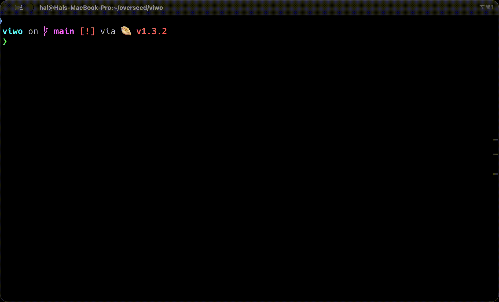

<div style="text-align: center;">

# viwo-cli

<i>⚡️Fastest way one-shot prompts with Claude Code ⚡</i>

<div>

[](https://github.com/hesreallyhim/awesome-claude-code)

</div>

</div>

---


Ever wanted to test out an idea or fix a bug, but you didn't want
to pollute your working branch? Or do you ever get super annoyed by all the questions and permissions Claude
asks you?

Well, **VIWO** (**Vi**rtual **Wo**rkspaces) might just be your solution:

- **Docker-sandboxed environments**: In order to use Claude Code with `--dangerously-skip-permissions`, we are
using Docker to sandbox the runtime environment. 
- **Git worktrees**: Maintain a clean separation between your working branch and Claude's branch—so you can work while Claude works!
- **Ease-of-use**: Quickly jump in to a worktree session by opening it in your favourite IDE.
- **Multiple agents**: With VIWO, it's extremely easy to spin up multiple agents to go do your task for you.
- **Recap of changes made**: View a recap of the work completed by AI directly inside VIWO CLI.
- **Improved multiline support**: Paste in large amounts of text and play around with your prompt before submitting.
- [COMING SOON] **GitHub/GitLab integration**: Once you're done, let AI handle submitting "your" work for you!



## Table of Contents
<!-- TOC -->
* [viwo-cli](#viwo-cli)
  * [Table of Contents](#table-of-contents)
  * [Installation](#installation)
  * [Quick Start](#quick-start)
  * [Post Install Hooks](#post-install-hooks)
  * [How it works](#how-it-works)
  * [Security](#security)
  * [🚀 Development Guidelines](#-development-guidelines)
    * [Prerequisites](#prerequisites)
    * [Installation](#installation-1)
  * [📦 Project Structure](#-project-structure)
  * [🛠️ Development](#-development)
    * [Running the CLI](#running-the-cli)
    * [Making Changes](#making-changes)
    * [Type Checking](#type-checking)
    * [Testing](#testing)
    * [Code Quality](#code-quality)
  * [📝 CLI Usage](#-cli-usage)
    * [Initialize a new session](#initialize-a-new-session)
    * [List all sessions](#list-all-sessions)
  * [🏗️ Building for Production](#-building-for-production)
  * [🧹 Cleaning](#-cleaning)
  * [📚 Architecture](#-architecture)
    * [Core Package (`@viwo/core`)](#core-package-viwocore)
    * [CLI Package (`@viwo/cli`)](#cli-package-viwocli)
  * [Uninstall](#uninstall)
    * [Linux & macOS](#linux--macos)
    * [Windows](#windows)
<!-- TOC -->

## Installation

**MacOS & Linux**

```bash
curl -fsSL https://raw.githubusercontent.com/OverseedAI/viwo/main/install.sh | bash
```

**Windows**

```powershell
irm https://raw.githubusercontent.com/OverseedAI/viwo/main/install.ps1 | iex
```

**Note:**
- You may need to restart your terminal after installation for the PATH changes to take effect.

## Quick Start

After installation, initialize your first session:

```bash
# Register your Anthropic API key
viwo auth 

# Register a repository
cd /path/to/your/repo
viwo register # viwo register /path/to/your/repo also works

# Start a session
viwo start

# List sessions
viwo list
```

## Post Install Hooks

You can add post install hooks via a YAML config file.

Add the `postInstall` property and add in any scripts you want
to run after your git worktree is initialized.

This is meant for easily initializing your git worktree for development and testing.

```yaml
postInstall:
  # Install dependencies
  - npm install

  # Build the project
  - npm run build

  # Copy environment file
  - cp .env.example .env
```

## How it works

The end result is a Claude Code instance in a Docker container. To get there, VIWO takes a git repository,
creates a git worktree in a separate directory, then creates a Docker container with a volume mount to that
new git worktree. The Docker container then runs a fresh installation of Claude Code in "print" mode with
`--dangerously-skip-permissions` enabled to help you one-shot your prompts.

- `viwo auth` stores your API key in a sqlite database in your app data directory. This API key is then provided to the Docker containers that run Claude Code. 
- `viwo register` stores the repository path and name into the sqlite database for subsequent retrieval.
- `viwo start` creates a new git worktree and a Docker container. This container then runs `claude -p "YOUR PROMPT"`.

## Security

Running Claude with `--dangerously-skip-permissions` (DSP) comes with its own risks. The safest way to run Claude with
DSP would be isolated virtual machines. VIWO relies on the security of Docker containers to limit the attack surface of AI hackers,
but that does not mean Docker containers are inherently impenetrable. You can learn more about how Docker manages the
security of their containers [here](https://docs.docker.com/engine/security/).

## 🚀 Development Guidelines

### Prerequisites

- [Bun](https://bun.sh) v1.0 or higher
- Git
- Docker (Daemon must be running)

### Installation

1. **Clone and install dependencies**
   ```bash
   git clone <repository-url>
   cd viwo
   bun install
   ```

2. **Link the CLI globally**
   ```bash
   cd packages/cli
   bun link
   ```

3. **Verify installation**
   ```bash
   viwo --help
   ```

That's it! No build step required during development. 🎉

## 📦 Project Structure

```
viwo/
├── packages/
│   ├── core/          # Core SDK (@viwo/core)
│   └── cli/           # CLI tool (@viwo/cli)
└── apps/              # Future applications
```

## 🛠️ Development

### Running the CLI

Since this is a Bun monorepo with **direct source imports**, you can run the CLI immediately without building:

```bash
# Option 1: Run directly from source
bun packages/cli/src/cli.ts --help

# Option 2: Use the globally linked command (recommended)
viwo --help
```

### Making Changes

1. Edit source files in `packages/core/src/` or `packages/cli/src/`
2. Changes are immediately available - no build step needed!
3. Run the CLI to test your changes:
   ```bash
   viwo start
   ```

The core package uses **direct TypeScript source imports** - Bun's native TypeScript support makes this possible without compilation during development.

### Type Checking

```bash
# Check all packages
bun run typecheck

# Check specific package
cd packages/core && bun run typecheck
```

### Testing

```bash
# Run tests in core package
cd packages/core && bun test
```

### Code Quality

```bash
# Format code
bun run format

# Check formatting
bun run format:check

# Lint code
bun run lint
```

## 📝 CLI Usage

### Initialize a new session

```bash
viwo start
```

### List all sessions

```bash
viwo list
```

## 🏗️ Building for Production

While development doesn't require a build step, you can build for production/publishing:

```bash
# Build all packages
bun run build

# Build specific package
cd packages/core && bun run build
```

This creates the `dist/` directories with compiled JavaScript and type definitions.

## 🧹 Cleaning

Remove all build artifacts, caches, and dependencies:

```bash
bun run clean
```

## 📚 Architecture

### Core Package (`@viwo/core`)

The core package provides:
- Git worktree management
- Docker container orchestration
- AI agent initialization (Claude Code, Cline, Cursor)
- Session state management with Bun's native SQLite
- Port allocation

**Key Feature**: Uses **direct source imports** - exports TypeScript files directly without a build step during development.

### CLI Package (`@viwo/cli`)

A command-line interface built on top of `@viwo/core`:
- Interactive session management
- Pretty-printed output with colors and tables
- Progress indicators
- Comprehensive error handling

## Uninstall

### Linux & macOS

```bash
rm /usr/local/bin/viwo  # or wherever you installed it
```

### Windows

```powershell
# Remove the binary
Remove-Item "$env:LOCALAPPDATA\Programs\viwo\viwo.exe"

# Remove from PATH (optional)
# Open "Edit environment variables for your account" and remove the viwo directory from PATH
```
