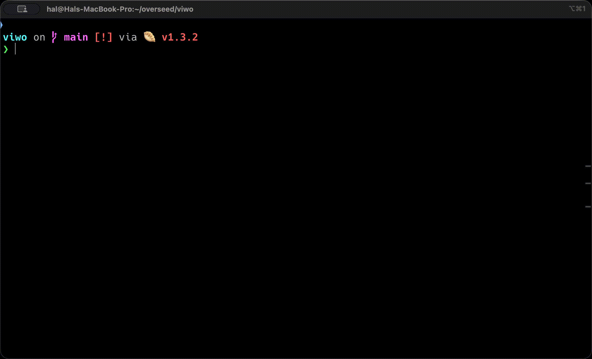

<div align="center">

# VIWO

**git worktree + containerization + agent harness**

Run coding agents in isolated git worktrees backed by disposable containers.

[](https://github.com/hesreallyhim/awesome-claude-code)

</div>

---

VIWO creates clean, isolated development sessions so you can let an agent work without cluttering your current branch or granting it access to your everyday shell.

Each session combines:

- **Git worktrees** for branch isolation
- **Containers** for runtime isolation
- **An agent harness** for launching and managing coding agents

Today, the primary runtime is **Claude Code** inside Docker, with VIWO handling worktree creation, container lifecycle, auth forwarding, prompt expansion, and session cleanup.



## Why VIWO

- **Isolated workspaces**: Every session gets its own git worktree and containerized runtime.
- **Fast agent launches**: Start a workspace and hand it to Claude Code in one command.
- **Safe parallel work**: Run multiple agent sessions against the same repository without polluting your current branch.
- **Project-aware setup**: Configure host-side setup, in-container setup, and custom bind mounts with `viwo.yml`.
- **Better auth support**: Use either an Anthropic API key or Claude subscription OAuth credentials.
- **Issue-driven workflows**: Expand GitHub issues and GitLab issues/MRs directly into the prompt.
- **Attach anytime**: Reconnect to a running session through `dtach` in the container.
- **Session visibility**: Sync Docker state, inspect running/completed sessions, and capture container output.

## Table of Contents

- [Installation](#installation)
- [Quick Start](#quick-start)
- [Project Configuration](#project-configuration)
    - [Post-install hooks](#post-install-hooks)
    - [Pre-agent commands](#pre-agent-commands)
    - [Custom bind mounts](#custom-bind-mounts)
- [How it works](#how-it-works)
- [Authentication](#authentication)
- [GitHub and GitLab integration](#github-and-gitlab-integration)
- [Security](#security)
- [Development](#development)
    - [Prerequisites](#prerequisites)
    - [Install dependencies](#install-dependencies)
    - [Running the CLI](#running-the-cli)
    - [Type checking](#type-checking)
    - [Testing](#testing)
    - [Code quality](#code-quality)
    - [Build](#build)
- [CLI Usage](#cli-usage)
- [Architecture](#architecture)
- [Uninstall](#uninstall)

## Installation

**macOS & Linux**

```bash
curl -fsSL https://raw.githubusercontent.com/OverseedAI/viwo/main/install.sh | bash
```

**Windows**

```powershell
irm https://raw.githubusercontent.com/OverseedAI/viwo/main/install.ps1 | iex
```

You may need to restart your terminal after installation so `viwo` is available on your `PATH`.

## Quick Start

```bash
# 1) Configure authentication
viwo auth

# 2) Add a repository
cd /path/to/your/repo
viwo repo add .

# 3) Start an isolated workspace + agent
viwo start

# 4) List sessions
viwo list

# 5) Attach to a running session
viwo attach
```

Notes:

- `viwo register` still works as an alias for `viwo repo add`.
- If you want to create the worktree first and launch the agent later, use `viwo create`.

## Project Configuration

VIWO loads project-specific configuration from `viwo.yml` or `viwo.yaml` at the repository root.

Example:

```yaml
postInstall:
    - cp .env.example .env

preAgent:
    - bun install
    - bun run build

binds:
    - ~/.cache/huggingface:/root/.cache/huggingface
    - ./shared-data:/shared:ro
    - source: ~/models
      target: /models
      readonly: true
```

### Post-install hooks

Use `postInstall` for commands that should run **on the host** after the git worktree is created and before any container starts.

Typical uses:

- copying env files
- generating local config
- host-side setup steps

```yaml
postInstall:
    - npm install
    - npm run build
    - cp .env.example .env
```

### Pre-agent commands

Use `preAgent` for commands that should run **inside the container** before Claude Code starts.

Typical uses:

- installing dependencies
- building the project
- preparing tools the agent will need during the session

```yaml
preAgent:
    - bun install
    - bun run build
```

### Custom bind mounts

Use `binds` to expose additional host directories inside the container.

This is useful for:

- caches
- datasets
- model files
- shared tooling or credentials that should be mounted read-only

Host paths may be absolute, use `~`, or be relative to the repository root. Container paths must be absolute.

```yaml
binds:
    - ~/.cache/huggingface:/root/.cache/huggingface
    - ./shared-data:/shared:ro
    - source: ~/models
      target: /models
      readonly: true
```

## How it works

VIWO orchestrates a session in two main phases:

1. **Create a worktree**
    - validate the repository
    - create a new git branch + worktree
    - copy env files if requested
    - run project `postInstall` hooks on the host

2. **Start the agent container**
    - resolve auth and model settings
    - expand GitHub/GitLab URLs in the prompt
    - apply configured bind mounts
    - run project `preAgent` commands inside the container
    - launch Claude Code in the isolated runtime

A few implementation details matter:

- The container sees the worktree at `/workspace`.
- Git metadata is mounted separately so git operations inside the container work correctly.
- Docker state is synced back to VIWO so session status and container output stay accurate.
- Completed or errored sessions can be cleaned up with `viwo clean`.

## Authentication

VIWO supports two auth modes:

### Anthropic API key

Store an API key in VIWO and pass it into the container as needed.

```bash
viwo auth
```

### Claude subscription OAuth

If you use Claude Code with a Claude subscription, VIWO can extract OAuth credentials from your host machine at session start and forward them into the container.

This avoids manually storing short-lived OAuth credentials in VIWO's database.

## GitHub and GitLab integration

VIWO can detect supported GitHub issue URLs and GitLab issue / merge request URLs in your prompt, fetch their content, and expand the prompt automatically before launching the agent.

You can configure provider tokens with:

```bash
viwo config github
viwo config gitlab
```

This is useful when you want the agent to work directly from:

- GitHub issues
- GitLab issues
- GitLab merge requests

## Security

Running agents with reduced interactive friction still carries risk. VIWO uses containers to reduce the blast radius, but containers are not the same thing as a hardened VM boundary.

In practice, VIWO's model is:

- **git worktree isolation** for source changes
- **container isolation** for runtime behavior
- **explicit bind mounts** for any extra host access

If you need stronger isolation guarantees, a VM-based workflow is safer than containers alone.

For more on Docker's security model, see the Docker docs: https://docs.docker.com/engine/security/

## Development

### Prerequisites

- [Bun](https://bun.sh)
- Git
- Docker

### Install dependencies

```bash
git clone <repository-url>
cd viwo
bun install
```

### Running the CLI

No build step is required during development.

```bash
# Run directly from source
bun packages/cli/src/cli.ts --help

# Or from the CLI package
cd packages/cli
bun run viwo --help
```

### Type checking

```bash
bun run typecheck
cd packages/core && bun run typecheck
```

### Testing

```bash
cd packages/core && bun test
```

### Code quality

```bash
bun run format
bun run format:check
bun run lint
```

### Build

```bash
bun run build
```

## CLI Usage

Common commands:

```bash
# Repository management
viwo repo add .
viwo repo list --json
viwo repo delete <id>

# Auth and config
viwo auth
viwo config model --set opus
viwo config ide --set vscode
viwo config worktrees --set /path/to/worktrees
viwo config github --auto
viwo config gitlab --auto

# Workspace lifecycle
viwo create --repo <id> --branch feature/test
viwo start --repo <id> --prompt "Fix the failing tests"
viwo start --repo <id> --prompt-file ./prompt.txt
viwo list
viwo attach <workspace-id>
viwo clean
```

## Architecture

VIWO is a monorepo with two main packages:

### `@viwo/core`

The core SDK manages the session lifecycle:

- git worktree creation and cleanup
- Docker container orchestration
- agent initialization
- repository and session persistence
- configuration and credential handling
- GitHub / GitLab prompt expansion
- project config parsing for `viwo.yml`

Key architectural traits:

- **functional manager pattern** for core subsystems
- **schema-first validation** with Zod
- **SQLite + Drizzle ORM** for persisted state
- **direct TypeScript source exports** during development

### `@viwo/cli`

The CLI sits on top of `@viwo/core` and provides:

- interactive and non-interactive command flows
- session inspection and attach flows
- config and auth management
- preflight checks for database, git, Docker, and version status

## Uninstall

### Linux & macOS

```bash
rm /usr/local/bin/viwo
```

### Windows

```powershell
Remove-Item "$env:LOCALAPPDATA\Programs\viwo\viwo.exe"
```
